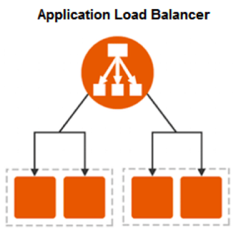

# Hands-on EC2-06 : Working with Application Load Balancer (ALB) using a Launch Template

Purpose of this hands-on training is to learn Application Load Balancer (ALB) working process. Especially, we’ll cover the details of the AWS solution suite and walk through how to set up a basic ALB.

## Learning Outcomes

At the end of the this hands-on training, students will be able to;

- create security group.

- create a target group.

- create Application Load Balancer.

- attach target group to ALB.

## Outline

- Part 1 - Creating a Security Group

- Part 2 - Launch Instances with Launch Template

- Part 3 - Creating a Target Group

- Part 4 - Creating Application Load Balancer together with Target Group



## Part 1 - Creating a Security Group

- Open the Amazon EC2 console at https://console.aws.amazon.com/ec2/.

- Choose Security Groups on the left-hand menu,

- Click the "Create Security Group" tab.

```text
Security Group Name  : ALBSecGroup
Description         : ALB Security Group
VPC                 : Default VPC
Inbound Rules:
    - Type: SSH----> Source: Anywhere
    - Type: HTTP ---> Source: Anywhere
Outbound Rules: Keep it as it is
Tag:
    - Key   : Name
      Value : ALB SEC Group
```

- Click "Create Security Group" button.

## Part 2 - Launch Two Instance Using the Launch Template

### Step 1 - Launch Template Configuration

- Launch Template Name

```text
Launch template name            : MyTemplate
Template version description    : MyTemplate
```

- Amazon Machine Image (AMI)

```text
Amazon Linux 2 AMI (HVM), SSD Volume Type, ami-0022f774911c1d690 (us-east-1)
```

- Instance Type

```text
t2.micro
```

- Key Pair

```text
Please select your key pair (pem key) that is created before
Example: clarusway.pem
```

- Network settings

```text
Network Platform : Virtual Private Cloud (VPC)
```

- Security groups

```text
Please select security group named ALBSecGroup
```

- Storage (volumes)

```text
keep it as default (Volume 1 (AMI Root) (8 GiB, EBS, General purpose SSD (gp2)))
```

- Resource tags

```text
Key             : Name
Value           : ALBTargetInstance
Resource type   : Instance
```

- Network interfaces

```text
Keep it as it is
```

- Within Advanced details section, we will just use user data settings. Please paste the script below into the `user data` field.

```bash
#!/bin/bash

#update os
yum update -y
#install apache server
yum install -y httpd
# get private ip address of ec2 instance using instance metadata
TOKEN=`curl -X PUT "http://169.254.169.254/latest/api/token" -H "X-aws-ec2-metadata-token-ttl-seconds: 21600"` \
&& PRIVATE_IP=`curl -H "X-aws-ec2-metadata-token: $TOKEN" http://169.254.169.254/latest/meta-data/local-ipv4`
# get public ip address of ec2 instance using instance metadata
TOKEN=`curl -X PUT "http://169.254.169.254/latest/api/token" -H "X-aws-ec2-metadata-token-ttl-seconds: 21600"` \
&& PUBLIC_IP=`curl -H "X-aws-ec2-metadata-token: $TOKEN" http://169.254.169.254/latest/meta-data/public-ipv4` 
# get date and time of server
DATE_TIME=`date`
# set all permissions
chmod -R 777 /var/www/html
# create a custom index.html file
echo "<html>
<head>
    <title> Congratulations! You have created an instance from Launch Template</title>
</head>
<body>
    <h1>This web server is launched from launch template by YOUR_NAME</h1>
    <p>This instance is created at <b>$DATE_TIME</b></p>
    <p>Private IP address of this instance is <b>$PRIVATE_IP</b></p>
    <p>Public IP address of this instance is <b>$PUBLIC_IP</b></p>
</body>
</html>" > /var/www/html/index.html
# start apache server
systemctl start httpd
systemctl enable httpd
```

### Step-2: Launch Two Instances Using the Launch Template

- Go to Launch Templates section on left-hand menu on AWS EC2 Dashboard.

- Select the launch template named `MyTemplate`.

- Click `Actions >> Launch instance` from template interface.

```text
Number of instances  : 2
```

- Click "Launch Instance from Template"

- Go to the instance page from the left-hand menu . Show the differences of newly created instances on the browser (IP and dates) via entering public IP addresses.

## Part 3 - Create a target group

- Go to `Target Groups` section under the Load Balancing part on left-hand side and click it.

- Click `Create Target Group` button.

- Basic configuration.

```text
Choose a target type    : Instances
Target Groups Name      : MyFirstTargetGroup
Protocol                : HTTP
Port                    : 80
VPC                     : Default
Protocol version        : HTTP1
```

- Health checks

```text
Health check protocol   : HTTP
Health check path       : /
```

- Advance Health check settings.

```text
Port                    : Traffic port
Healthy treshold        : 5
Unhealthy treshold      : 2
Timeout                 : 5 seconds
Interval                : 10 seconds
Succes codes            : 200
```

- Tags

```text
Key                     : Name
Value                   : MyTargetGroup
```

- Click next.

- Select two instances that is created from Launch Template before and add to them to the target group.

```text
Ports for the selected instances : 80
```

- Click `Include as pending below` button.

- Show that two instances are added to the target group.

- Click `Create target group` button.

## Part 4 - Creating Application Load Balancer together with Target Group

- Go to the Load Balancing section on left-hand menu and click `Load Balancers`.

- Tap `Create Load Balancer` button.

- Click `Create` button inside the `Application Load Balancer` section.

- Basic configuration

```text
Load Balancer Name     : MyFirstALB
Scheme                 : Internet-facing
IP address type        : IPv4
```

- Network mapping

```text
VPC          : Default VPC
Mappings     : Select all AZ's
```

- Security groups

```text
Security groups  : Remove Default SG and select ALBSecGroup
```

- Listeners and routing
```text
Protocol       : HTTP
Port           : 80
Default action : Forward to MyFirstTargetGroup
```

- Keep rest as is

- Review if everything is ok, and then click the `Create load balancer` button

```text
Successfully created load balancer!
```

- Click `Close` tab

- Please wait for `State` to turn into `active` from `provisioning`.

- Show on the browser that how the requests are routed to different instance with the help of the ALB.

```text
- Select Load Balancer named MyFirstALB
- Copy the ALB's DNS name. It should be something like `MyFirstALB-1185163036.us-east-1.elb.amazonaws.com`
- Paste is on browser and refresh it
- Show the changing Public and Private IP addresses and time that the instances was created
```

- Explain the monitoring dashboard of ALB.
