# API Gateway - [DEMO] Methods and Resources

In this DEMO, I will step you through how to create a Regional API, 2 resources and 2 GET methods with Lambda integrations.

First open two tabs from AWS Console.
 * One for `API gateway`
 * Second one for `Lambda`

Go to `API Gateway` -> `REST API` -> `Build`

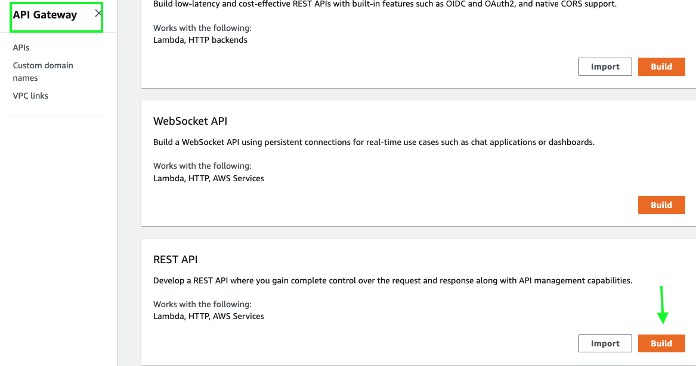

 * If you are seeing a pop-up with the name of `Create your first API`, click `OK`.

Next create a New API named as `mycatapi` and click `Create API`.

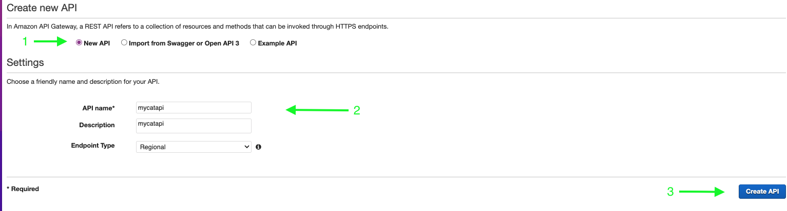

Now, we will switch to `Lambda` and create our first Lambda function for `api-root-resource` as compute resource of our API with below information.

```python
Name : api-root-resource
Runtime: Python 3.9
```
Once function is created, we will replace the `lambda_function.py` code with below code:

```python
import json
import os

def lambda_handler(event, context):
  print (event)
  body = "cats are the best!"
  statusCode = 200
  return {
    "statusCode": statusCode,
    "body": json.dumps(body),
    "headers": {
      "Content-Type": "application/json"
    }
  }
```
Then click `Deploy`. Go to `Test` tab and click `Test`. You should see `200` statusCode with below content.

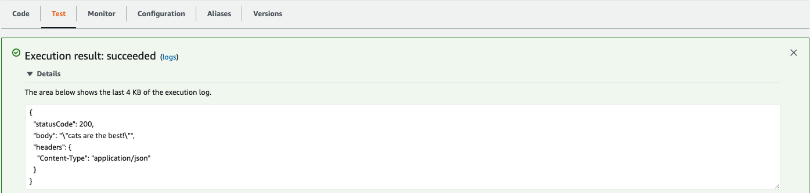

Let's create our second Lambda function for `api-listcats-resource` as compute resource of our API with below information.

```python
Name : api-listcats-resource
Runtime: Python 3.9
```
Once function is created, we will replace the `lambda_function.py` code with below code:

```python
import json
import os

def lambda_handler(event, context):
  print (event)
  statusCode = 200
  return {
    "statusCode": statusCode,
    # Imagine this is being loaded from a database
    "body": json.dumps(["roffle", "truffles", "penny", "winkie"]),
    "headers": {
      "Content-Type": "application/json"
    }
  }
```
Then click `Deploy`. Go to `Test` tab and click `Test`. You should see `200` statusCode with below content.

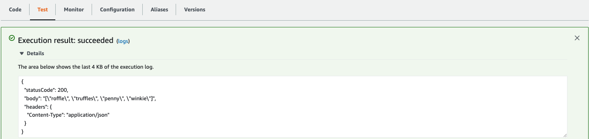

Since we have created Lambda functions backing up our APIs, now we can switch back to `API Gateway` showing `mycatapi` page.

First we will create `GET` method, Click `Actions` -> `Create Method`. Then  from dropdown menu choose `GET` and click `tick` sign to approve your selection.

Next complete comfiiguration as below and click `Save`.
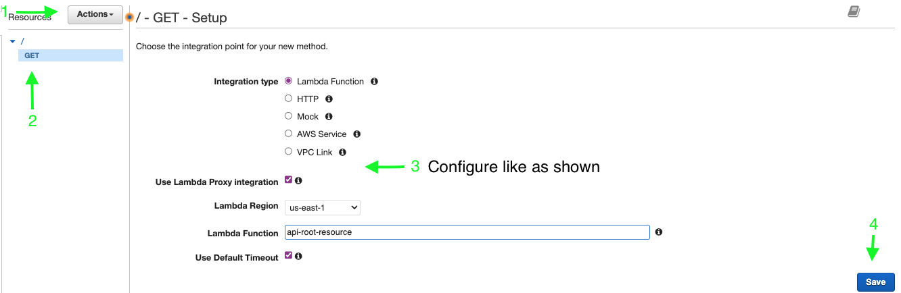

Now, we will `Deploy` our API to the stage we define.

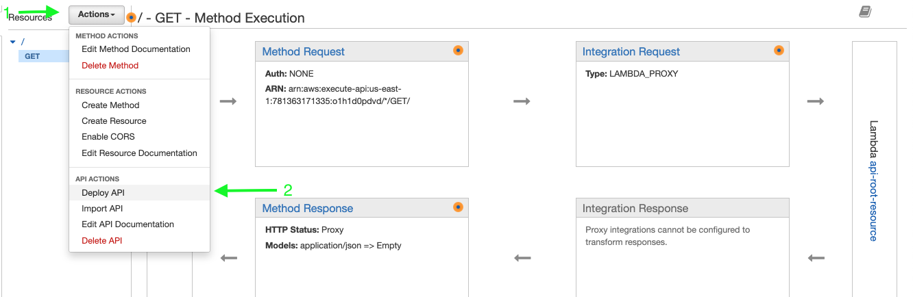

Since there is no stage defined before, click on `New Stage`, name as `dev` click `Deploy`.
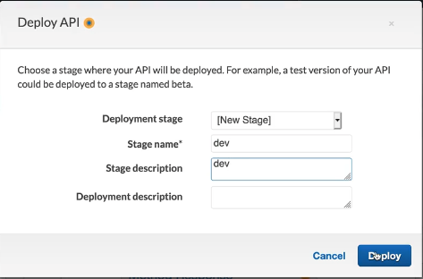

Once we deploy our API, we will get an `Invoke URL`, click on link, open in new tab and see the result. This is the response returned by Lambda code we created.
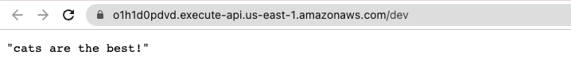 

We can see the logs of for lambda function under CloudWatch `Log groups` --> `aws/lambda/api-root-resource`
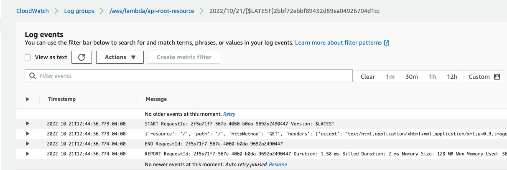

Similary, we can create another resource with the name `listcats`.
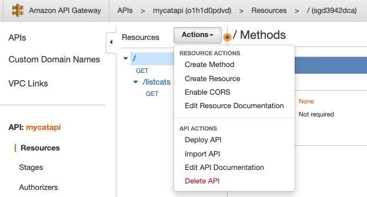 
Go to `Actions` -> `Create Method` -> select `GET` -> confirm.
Apply the same settings same as before and `Save`. Go to `Actions` -> `Deploy` it to `dev` stage.
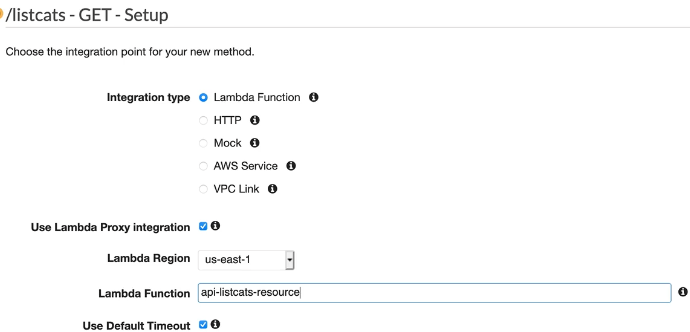 

Once you invoke the dev url by adding `/listcats` , you will be able to see the new results.
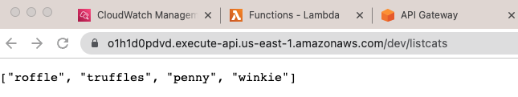

Last step to cean up, go to `APIs` -> select `mycatapi` -> `Delete`.
We're all set!!